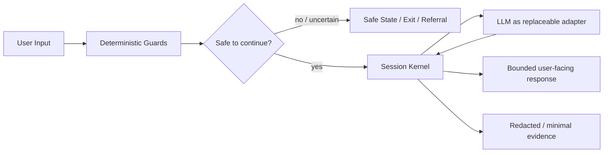

# Traumtänzer – Governance & Knowledge Repository

Dieses Repository ist das Governance- und Wissens-Framework für **Traumtänzer** (Modus Mono): einen privaten, digitalen Erfahrungsraum zur Selbstreflexion durch Erlebnis.

---

## Portfolio-Überblick — Responsible AI / Concept-to-System

Traumtänzer ist für mein Portfolio vor allem ein **Responsible-AI- und Governance-Case**.

Die zentrale Frage lautet:

> **Wie übersetzt man eine sensible, abstrakte Produktidee in ein System, das seine eigenen Grenzen technisch und sprachlich ernst nimmt?**

Das Projekt arbeitet mit einem ungewöhnlich strikten Grundsatz: Safety, Privacy und zulässige Produkt-Claims werden **vor** einer breiten Produktisierung als Systemverträge definiert. Ein Sprachmodell ist dabei ein austauschbarer Adapter — nicht die Instanz, die Session-Logik, Safety oder Persistenz kontrolliert.

### Status — was existiert und was nicht

| Ebene | Aktueller Stand |
|---|---|
| **Konzept / Product Canon** | vorhanden und versioniert |
| **Governance / Safety / Privacy / Claims** | vorhanden und bindend |
| **Lokales Evidence-Harness** | vorhanden; deterministische Kernel-/Guard-/Fault-Injection-Evidence |
| **Runtime-/Pilot-Foundation** | technische Runtime-/Evidence-Pfade vorhanden; ein nicht-providergekoppelter Hetzner-Evidence-Lauf ist dokumentiert |
| **Externer LLM-Pfad für Live-Nutzer** | **nicht freigegeben** |
| **Freigegebener Pilot / Live-Produkt** | **nein / blockiert** |
| **Therapie-/Diagnoseprodukt** | **ausdrücklich nein** |

Der aktuelle operative Stand wird in [CURRENT_STATUS](knowledge/CURRENT_STATUS.md) gepflegt. Diese Übersicht ist eine Portfolio-Surface und ersetzt den Canon nicht.

### Vereinfachte Systemarchitektur

Wichtig: Das LLM kontrolliert weder Safety-Entscheidungen noch Persistenz. Die deterministischen Guards und der Kernel bleiben die Kontrollinstanz.

### Was dieser Case belegt

- **Concept-to-System:** abstrakte Produktidee → konkrete Systemgrenzen, Canons und technische Verträge.
- **Responsible AI:** Safety- und Privacy-Grenzen werden nicht nur als Disclaimer behandelt.
- **Claim Hygiene:** das System darf keine Therapie-, Diagnose-, Heil- oder autoritären Deutungsclaims erzeugen.
- **Fail-closed Design:** bei Unsicherheit wird nicht improvisiert, sondern in einen definierten sicheren Zustand gewechselt.
- **Agent Governance:** KI-Agenten sind Zuarbeiter; sie dürfen Safety, Privacy oder Claims nicht selbstständig ausweiten.
- **Evidence statt Selbstbehauptung:** Tests, Provider-Freigaben und Pilotstatus dürfen nicht erfunden oder aus Teil-Evidence hochgestuft werden.

### Meine Rolle / AI-assisted Development

Meine Kernarbeit liegt bei:

- Konzept- und Systementwicklung,
- Definition von Grenzen und Nicht-Zielen,
- Requirements und Governance,
- Safety-/Privacy-/Claim-Verträgen,
- Orchestrierung mehrerer KI-Systeme als Zuarbeiter,
- Review, Konsistenzprüfung und Evidence.

Die Umsetzung ist stark AI-assisted. Dieses Repo ist daher kein Claim auf klassische Software-Engineering-Seniorität und kein Beleg dafür, dass ich jeden technischen Bestandteil manuell programmiert habe.

Für die komplette Portfolio-Story siehe [Portfolio Case Study](docs/PORTFOLIO_CASE_STUDY.md).

---

## Was dieses Repo ist

Ein dokumentations- und governance-first Repository. Es enthält:

- den vollständigen **Canon** (Regeln, Grenzen, Prioritäten) für das Projekt
- **Governance-Dokumente** (CONSTITUTION, GOVERNANCE, AGENT_POLICY)
- **Domain-Canons** (Claims, Safety, Privacy, Architecture)
- **Projektwissen** (Status, Roadmap, Systemkontext, Invarianten)
- **Lokales Evidence-Harness** (`harness/`): deterministische Guard-/Kernel-Läufe für nicht-provider-gekoppelte Baseline-Fälle; kein Deployment, kein LLM-Provider, kein Pilot-Scope

Das Repository bleibt governance- und evidence-first, enthält inzwischen aber neben Dokumentation auch ein lokales deterministisches Harness sowie eine dokumentierte Runtime-/Evidence-Foundation. Das ist **kein freigegebener Pilot und kein Live-Produkt**. Für den jeweils aktuellen technischen und operativen Stand ist [CURRENT_STATUS](knowledge/CURRENT_STATUS.md) autoritativ.

---

## Was dieses Repo nicht ist

- kein freigegebenes Endnutzerprodukt, kein freigegebener Pilot und kein Live-Service
- kein Therapieangebot, keine Diagnostik und keine medizinische Zweckbestimmung
- kein generisches Starter-Kit oder Template-Pack

---

## Einstieg

| Dokument | Zweck |
|---|---|
| [KNOWLEDGE_HUB](knowledge/KNOWLEDGE_HUB.md) | Zentraler Einstiegspunkt in alle Canon- und Wissens-Dokumente |
| [CONSTITUTION](knowledge/governance/CONSTITUTION.md) | Oberste, nicht verhandelbare Projektregeln |
| [PROJECT_META](knowledge/project/PROJECT_META.md) | Projektdefinition, Nicht-Ziele, Risiken, P0/P1/P2 |
| [CLAIMS_FRAMEWORK](knowledge/project/CLAIMS_FRAMEWORK.md) | Was Traumtänzer behaupten darf – und was nicht |
| [SAFETY_PLAYBOOK](knowledge/project/SAFETY_PLAYBOOK.md) | Exit-First, Safeword, Trigger-Handling |
| [PRIVACY_BY_DESIGN](knowledge/project/PRIVACY_BY_DESIGN.md) | Datensparsamkeit, Retention, Löschung |
| [ARCHITECTURE_OVERVIEW](knowledge/architecture/ARCHITECTURE_OVERVIEW.md) | MVP-Architektur-Canon |
| [CURRENT_STATUS](knowledge/CURRENT_STATUS.md) | Aktueller Projektstand |

---

## Beitragen

Siehe [CONTRIBUTING.md](CONTRIBUTING.md). Kurzfassung: PR-only für Canon-Änderungen, kleine Scopes, Evidence in der PR-Beschreibung.

---

## Projektkontext

- **Owner:** Jannek Büngener
- **Modell:** Solo-Maintainer + KI-Zuarbeit (Claude, Codex, Gemini)
- **Sprache:** primär Deutsch
- **Phase:** Governance/Canon etabliert; lokales Harness und Runtime-/Evidence-Foundation vorhanden; Pilot-/Live-Freigabe bleibt durch offene P0-Gates blockiert

---

## Sicherheit

Sicherheitsrelevante Meldungen bitte nicht als öffentliches Issue. Siehe [SECURITY.md](SECURITY.md).
